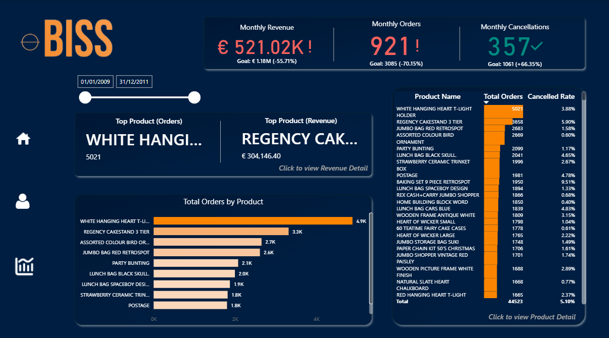

# Retail Sales & Customer Analytics Dashboard

<a href="https://app.powerbi.com/view?r=eyJrIjoiN2IzMGQ5ZTAtYzZhZi00ZTgwLWJiODktYTg2YmIzN2RkYmUwIiwidCI6IjM1ODAxOWMyLWZmMWQtNGRlOC04MDBlLTk2YTRkMzgwNzMwYyIsImMiOjl9" rel="nofollow">Click here to open the Retail Sales & Customer Analytics Dashboard</a>

Interactive Power BI dashboard developed to analyse retail sales performance, customer behaviour, product performance, revenue trends and cancellations.

The report provides an executive overview of monthly revenue, orders and cancellations, while allowing users to drill into customer-level and product-level performance.

## Key Insights

- Monthly revenue, orders and cancellations versus targets
- Top products by orders and revenue
- Customer revenue, order volume and Average Order Value (AOV)
- Revenue and order trends over time
- Revenue distribution by country and product
- Product-level performance and cancellation trends
- Geographic sales distribution across markets

## Dashboard Pages

### Sales Summary
Executive overview of revenue, orders, cancellations and top-performing products.

### Customer Detail
Customer-level analysis including total revenue, order volume, Average Order Value and monthly purchasing behaviour.

### Revenue Detail
Geographic and product-level revenue analysis using map, decomposition tree and market segmentation.

### Product Performance
Detailed product analysis including monthly revenue, order targets, revenue targets, price adjustments and cancellation trends.

## Dashboard Features

- KPI tracking against business targets
- Customer and product drill-down analysis
- Time-series trend analysis
- Geographic sales analysis
- Decomposition tree for revenue exploration
- What-if price adjustment analysis
- Interactive filtering and navigation

## Tools

- Power BI
- DAX
- Data Modeling
- What-if Parameters
- Drill-through
- Decomposition Tree
- Data Visualization
## Dashboard Preview

