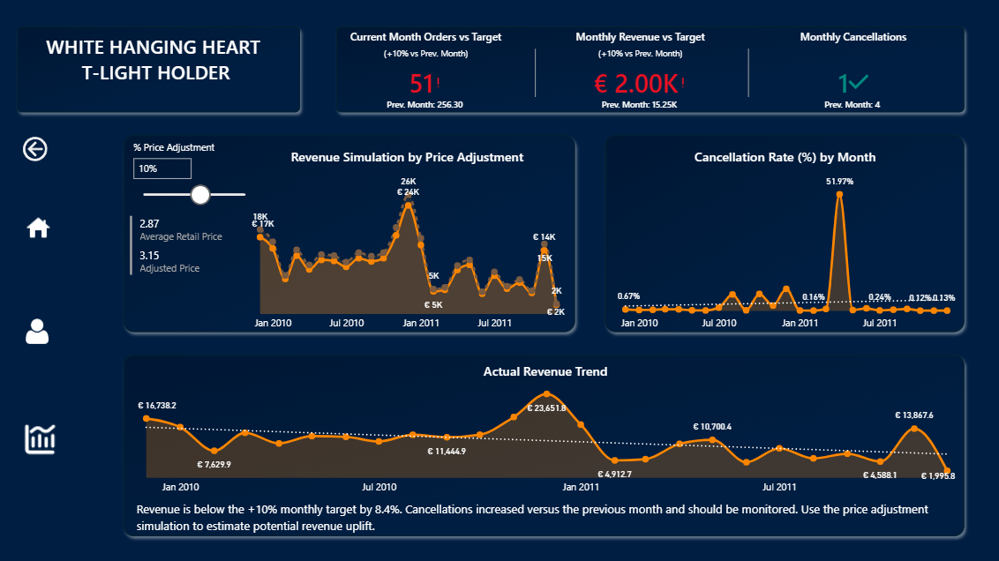

# Retail Sales & Customer Analytics Dashboard

Interactive Power BI dashboard developed to analyse retail sales performance, customer behaviour, product performance, revenue trends and cancellations.

The report provides an executive overview of monthly revenue, orders and cancellations, while allowing users to drill into customer-level, product-level and country-level performance. It also includes a What-If price adjustment simulation to estimate potential revenue impact and support pricing decisions.

<a href="https://app.powerbi.com/view?r=eyJrIjoiN2IzMGQ5ZTAtYzZhZi00ZTgwLWJiODktYTg2YmIzN2RkYmUwIiwidCI6IjM1ODAxOWMyLWZmMWQtNGRlOC04MDBlLTk2YTRkMzgwNzMwYyIsImMiOjl9" rel="nofollow">Click here to open the Retail Sales & Customer Analytics Dashboard</a>

## Key Insights

- Monthly revenue, orders and cancellations compared against business targets
- Product-level revenue simulation using What-If price adjustment parameters
- Top products by order volume and revenue contribution
- Customer revenue, order volume, revenue share and YoY growth
- Revenue concentration by country and product
- Cancellation rate trends over time
- Country-level revenue contribution analysis

## Dashboard Pages

### Sales Summary
Executive overview of monthly revenue, orders, cancellations and top-performing products.

### Customer Detail
Customer-level analysis including revenue, order volume, revenue share, YoY growth and monthly purchasing behaviour.

### Revenue Detail
Country and product-level revenue contribution analysis using treemap, bar chart and decomposition tree.

### Product Performance
Detailed product analysis including monthly revenue, order targets, revenue targets, What-If price adjustment simulation and cancellation rate trends.

## Dashboard Features

- KPI tracking against monthly business targets
- What-If price adjustment analysis
- Customer and product drill-down analysis
- Revenue contribution analysis by country and product
- Time-series trend analysis
- Cancellation rate monitoring
- Decomposition tree for revenue driver exploration
- Interactive filtering and navigation

## Tools

- Power BI
- DAX
- Data Modeling
- What-If Parameters
- Drill-through
- Decomposition Tree
- Data Visualization
- KPI Design

## Report Preview

